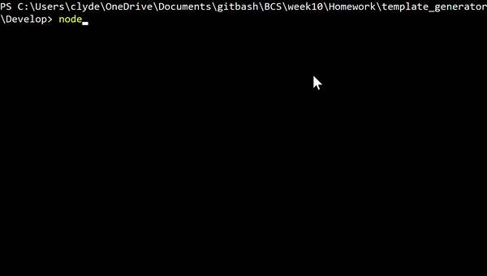

# Template Generator - Employee Summary

## Description

[](https://opensource.org/licenses/MIT)


A CLI program that turns test user input about information about a software engineering team into an html document powered by Bootstrap. Team members on html page are delinated as with serparate cards on the page in the designated template spot found in `templates/main.html`.


---
## Table of Contents 

* [Installation](#Installation)
* [Usage](#Usage)
* [Credits](#Credits)
* [License](#License)
* [Tests](#Tests)
* [Questions?](#Questions?)

---
## Installation

Upon downloading the project files, open the command line and navigate to the directory the project is in. Once there, go to the `Develop` and type the command:
```
npm install
```
To install all dependancies. If you prefer, install the dependancies independantly as follows:
- install `chalk` for design and reading ease
```
npm install chalk
```
-install `supports-color` for testing if your CLI supports coloring
```
npm install supports-color
```
- install `inquirer` for user input
```
npm install inquirer
```
- (optional) install jest for testing
```
npm jest --save-dev
```

## Usage

This project's purpose is to showcase CLI, js, and HTML skillset of the user and is not intended for commercial use of any kind. Users are permitted to use the code for personal use.

To run the program navigate in the command line to the `Develop` directory and with `node.js` installed, run the following command:
```
node app.js
```

## License

© 2020 [Clyde Baron Rapinan](https://github.com/clydebaron2000). Under the [MIT](https://opensource.org/licenses/MIT) license.

## Contributing

All users can contribute to this project.

## Tests

This project's tests are powered by `jest`. To see installation instructions for `jest` refer to the Install section. 

To run all tests to ensure employee classes are working, navigate to the `Develop` directory and type in the command:
```
npm test
```
To ensure that the tests run with the highest verbosity and speed, ensure in the `package.json` File that the 'sripts'>'test' attribute has the following:
```
"jest --verbose --runInBand"
```
Jest's current version runs into many performance issues. To rollback on `jest` version check out [this article.](https://itnext.io/how-to-make-your-sluggish-jest-v23-tests-go-faster-1d4f3388bcdd)

## Questions?

Have questions about my project? [Email me](mailto:clydebaron2000@gmail.com) at clydebaron2000@gmail.com.

---
Check out my other projects [here!](https://github.com/clydebaron2000)